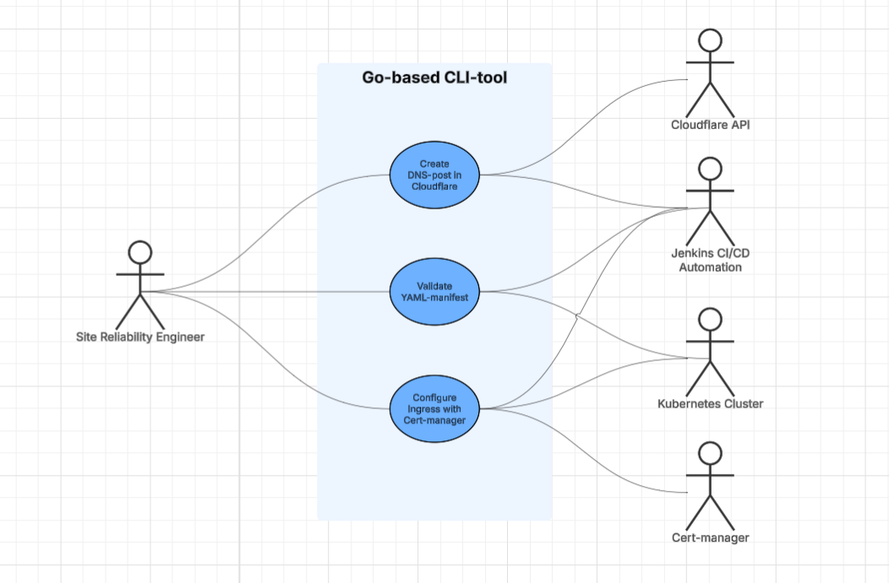
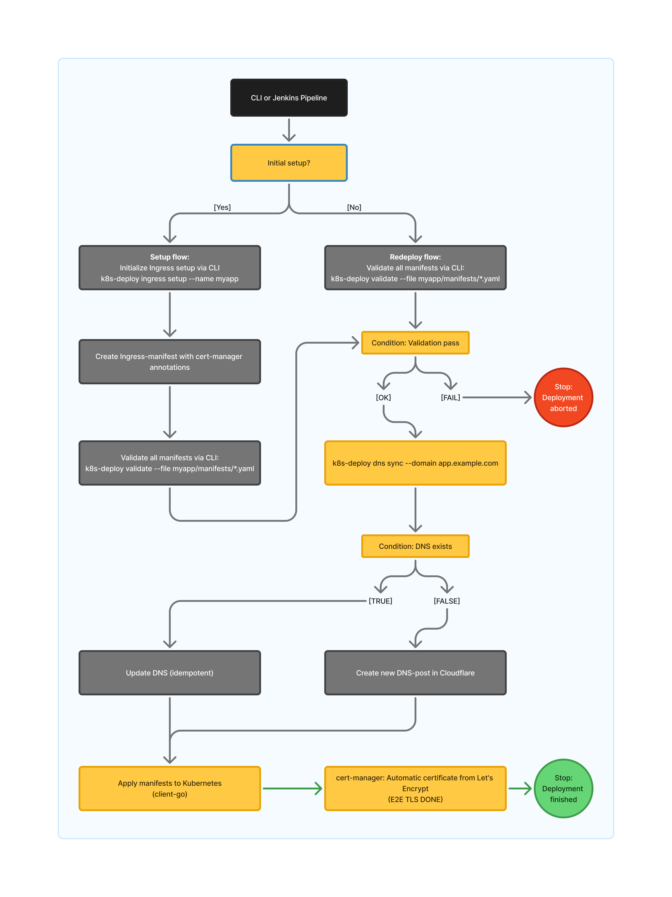
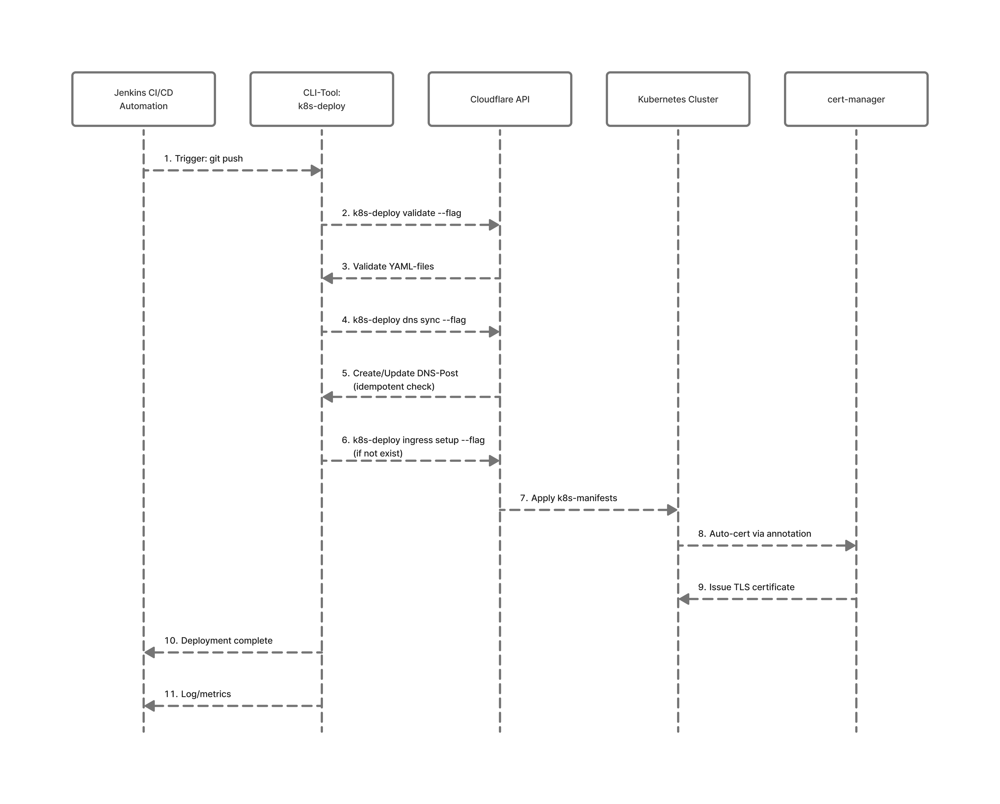

# Requirements

[Non-functional Requirements](analysis/nonfunctional-requirements.md)

[Functional Requirements](analysis/functional-requirements.md)

# UML Diagrams

## Use-case Diagram:

## Activity Diagram:

## Sequence Diagram:
